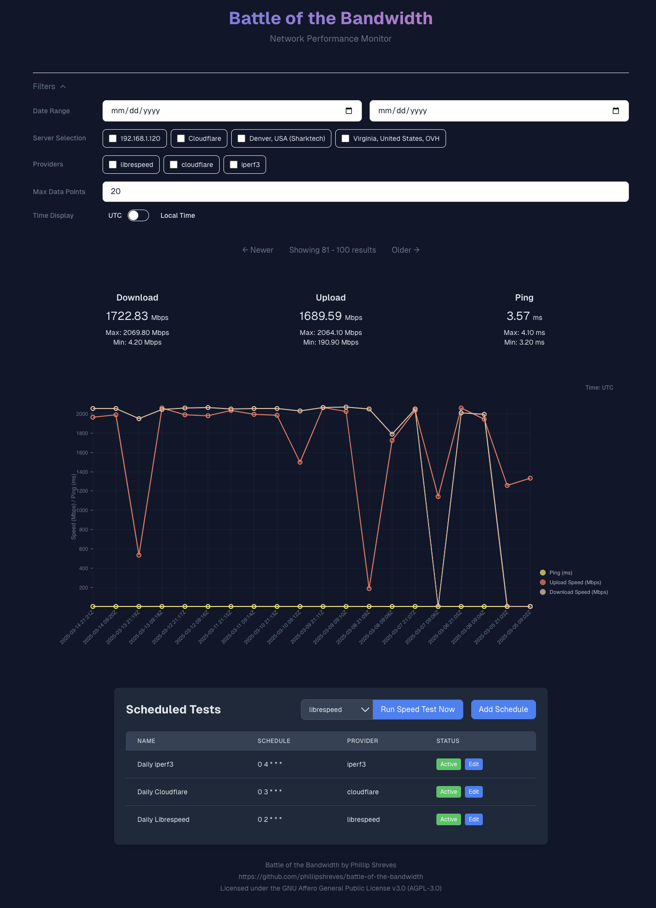

# Battle of the Bandwidth

A modern web application for tracking and monitoring network performance. 

The application runs speed tests utilizing cron schedules and stores the result. The results are then displayed on a filtered chart to provide a quick overview of network performance.

### Showcase



### Architecture

The application consists of four main components:
- **React Frontend**: React application that provides the user interface
- **Go Backend**: Primary API server that handles speed tests and data storage
- **Node.js Backend**: Complementary service providing additional functionality through provider packages
- **Postgres Database**: Persists speed test data

Containerized for your deployment pleasure.

### File Structure

- `frontend/` - React-based web interface, utilizing Next.js
- `backend/` - API server written in Go
- `backend-node/` - API server written in Typescript(for Cloudflare Library), utilizing NestJS
- `docker-compose.yml` - Docker Compose configuration for easy container deployment

## Installation

### Using Docker

```bash
# Clone the repository
git clone https://github.com/phillipshreves/battle-of-the-bandwidth.git

# Change directories
cd battle-of-the-bandwidth

# Start the application using Docker Compose
docker compose up -d
```

## How to use

You can visit http://localhost:40080/ to view the web application. You will not have any starting data, so do not be alarmed by the empty chart. 

To start a speed test instantly, you can use the "Run Speed Test Now" button in the Settings component.

To schedule a speed test, click the "Add Schedule" button above the Schedules table in the Settings component. This will take you to a new page where you can edit the schedule.

Filters are available above the chart to allow for a more precise data view.

### Working with Schedules

The Schedules table shows all your configured speed tests that run automatically based on cron expressions:

- **Name**: Identifies your schedule for easy reference
- **Schedule**: Shows the cron expression that determines when tests run
- **Provider**: Indicates which speed test provider is used
- **Status**: Shows whether the schedule is set to run. If active, the schedule will run at the next interval.  If inactive, does nothing.
- **Last Run**: Displays when the schedule last executed a speed test

#### Managing Schedules:
- **Create**: Click "Add Schedule" to create a new scheduled test
- **Edit**: Click the edit icon on any schedule row to modify its settings
- **Delete**: Click the delete icon to remove a schedule
- **Enable/Disable**: Toggle the status switch to pause or resume a schedule without deleting it

#### Cron Expressions:
Schedules use standard cron syntax (e.g., `0 */6 * * *` for every 6 hours). The application supports:
- Minute-level granularity
- Day-of-week specifications
- Range expressions
- Step values

The cron service utilized [robfig's cron package](https://github.com/robfig/cron). Confirm support of cron functionality by visiting the project.

## Acknowledgements

This application utilizes [CloudFlare](https://github.com/cloudflare/speedtest?tab=readme-ov-file) and the [LibreSpeed](https://librespeed.org/) project to perform speed tests. Please visit their sponsors to support the project.
